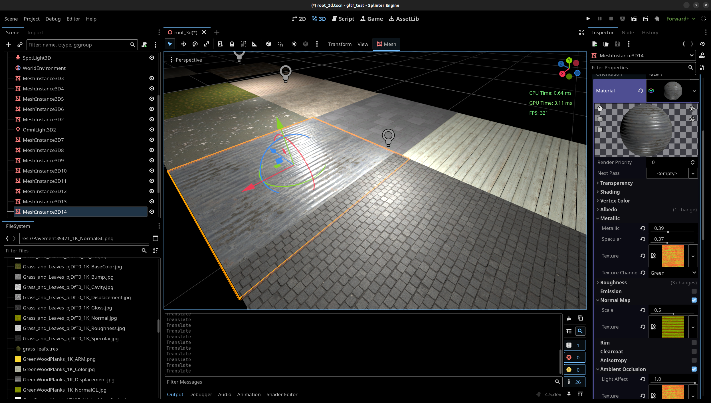

# Splinter Engine

Fork of Godot:

- Improved Blender<->Godot workflow
  - particularly in the area of: cutscenes, animation baking, PBR materials, collisions
- Integration with a custom asset server [[link]](https://github.com/kroketio/splinter_engine_asset_server)
- Integration with a high-performance HTML renderer that we wrote [[link]](https://godotwebview.com)
- Various small modifications to accelerate 3D development

For a full list, look at the commit(s) and/or code.

While open-source, we do not accept pull requests. This project solves our needs, 
and is not meant for adoption by the public. We do not follow Godot coding 
standards, and our modifications are quick & dirty, often directly hacked 
into various parts, in questionable ways.

We follow Godot upstream, the master branch is rebased from time to 
time, currently we are somewhere between Godot 4.4 and 4.5.

# Notes

- Blender: multiscene import
- Blender: func_elevator
- Blender: -dobake and -dobake-x-x
- Blender: auto-gen collisions for worldspawn
- Blender: ignore lights
- Blender: always backface cull for mesh materials
- Blender: remove worldspawn mesh faces that are 'nodraw'
- io/image: player detection (terrible)
- Interop with external texture manager for PBR materials
- Cull lights by default (distance fade)
- dump class docs to /tmp/ when opened (linux only)
- enforce Blender 4.2.0

## Blender import

Blender >= 4.2.0

### Materials

Checks asset server for their PBR version, and installs/configures them.

### Auto collisions

Any Blender mesh which name starts with `worldspawn` automatically gets a `StaticBody3D` + concave collisions (trimex).

### Elevators

Any Blender mesh which name starts with `func_elevator` gets converted to an elevator, which in Godot produces: animatblebody, path3d, path3dfollow, etc.

For the points (elevator floors), create a `func_elevator1_curves.tres` (where `func_elevator1` is the Blender mesh object name in this example) file in the same directory. It will be automatically loaded. This is a Curves3D resource.

To attach more objects to the elevator, create `func_elevator1_child_scene.tscn` in the same directory. It will automatically be attached.

Note: this only works when the `.blend` file is somewhere in `res:///scenes/`

### multi-scene import

To activate multi-scene import, with all of its features, the `.blend` file should have at least 2 scenes, with specific naming:

- `01-main`
- `02-foo`
- `03-bar`
- etc.

